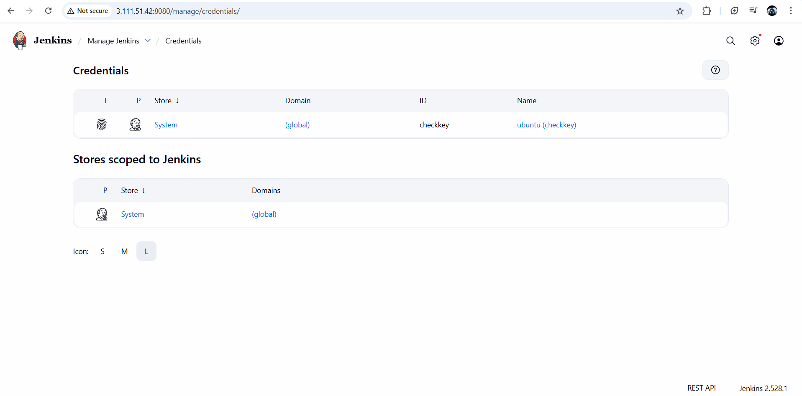
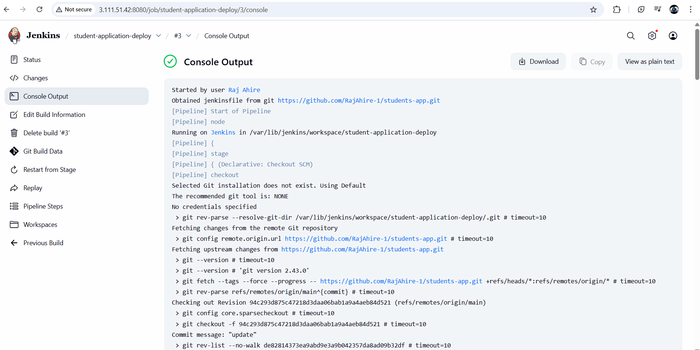
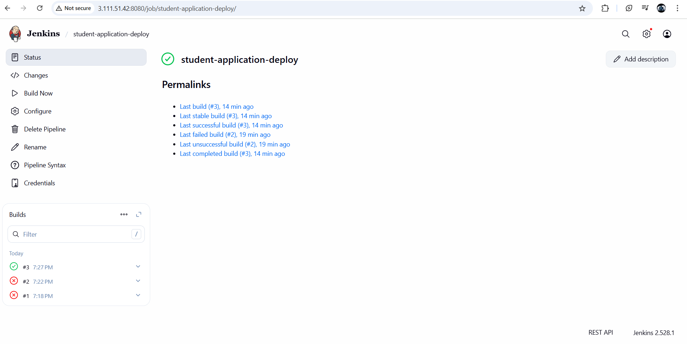
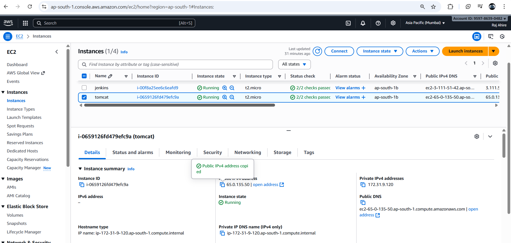
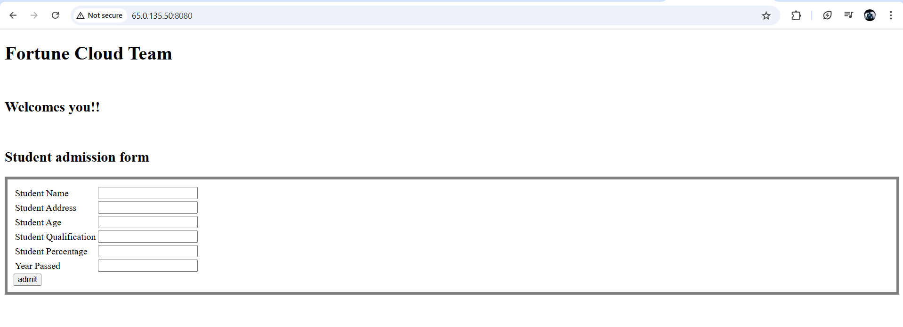
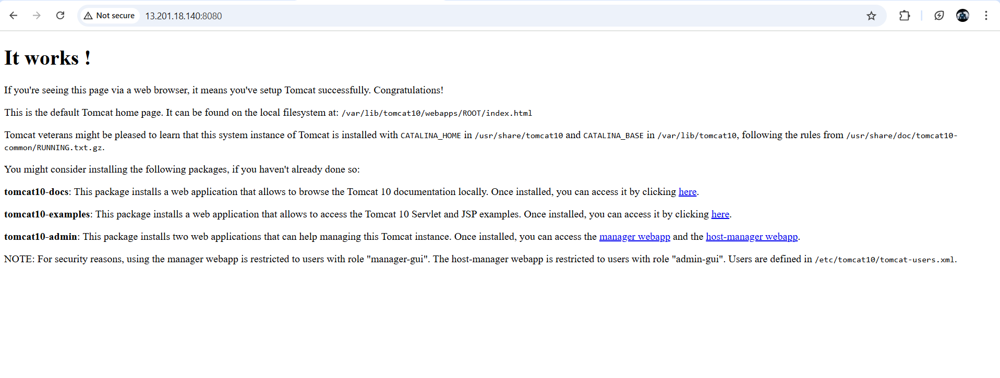

# Automated CI/CD Pipeline for Java Student Management Application

This repository demonstrates a **Java-based Student Management Web Application** deployed through a fully automated **CI/CD pipeline** using **Git, GitHub, Jenkins, AWS EC2, Maven, and Apache Tomcat**.

The project showcases an end-to-end DevOps workflow — automating everything from **code integration** to **deployment** — ensuring consistent, reliable, and fast software delivery.

---

## 1. Project Overview

The **Student Management Application** allows users to input and manage student details such as name, address, age, qualification, percentage, and passing year.

This project highlights **Continuous Integration and Continuous Deployment (CI/CD)** using Jenkins and AWS infrastructure to automate the deployment process of Java applications.

---

### Jenkins Credentials Setup



---

## 2. Project Objectives

The pipeline is designed to automatically:

1. Clone the project from GitHub.
2. Build the Java application using Maven.
3. Generate a deployable `.war` file.
4. Transfer the `.war` file to a Tomcat server hosted on another EC2 instance.
5. Restart the Tomcat service to deploy the latest version.
6. Make the web app accessible on the browser automatically.

---

## 3. Tools and Technologies Used

| Category             | Tools / Technologies         |
| -------------------- | ---------------------------- |
| Programming Language | Java                         |
| Build Tool           | Apache Maven                 |
| Version Control      | Git & GitHub                 |
| CI/CD Automation     | Jenkins                      |
| Cloud Platform       | AWS EC2 (Ubuntu)             |
| Application Server   | Apache Tomcat 10             |
| Pipeline Type        | Jenkins Declarative Pipeline |

---

## 4. CI/CD Workflow



The pipeline automates the entire process from code commit to deployment, ensuring a seamless development lifecycle.

---

## 5. Jenkinsfile (Pipeline Script)

Below is the Jenkinsfile used for building and deploying the Student Management Application automatically.

```groovy
pipeline {
    agent any

    environment {
        SERVER_IP   = '65.0.135.50'
        SSH_CRED_ID = 'checkkey'
        TOMCAT_PATH = '/var/lib/tomcat10/webapps'
        TOMCAT_SVC  = 'tomcat10'
    }

    stages {
        stage('Checkout') {
            steps {
                echo 'Cloning source code from GitHub...'
                git branch: 'main', url: 'https://github.com/RajAhire-1/students-app.git'
            }
        }

        stage('Build WAR File') {
            steps {
                echo 'Building the project using Maven...'
                sh 'mvn clean package'
            }
        }

        stage('Deploy to Tomcat Server') {
            steps {
                echo 'Deploying WAR file to Tomcat server on EC2...'
                sshagent(['checkkey']) {
                    sh '''
                    scp -o StrictHostKeyChecking=no target/*.war ubuntu@${SERVER_IP}:${TOMCAT_PATH}
                    ssh ubuntu@${SERVER_IP} 'sudo systemctl restart ${TOMCAT_SVC}'
                    '''
                }
            }
        }
    }

    post {
        success {
            echo 'Deployment completed successfully. Application is live on Tomcat server.'
        }
        failure {
            echo 'Build or deployment failed. Please check console logs for details.'
        }
    }
}
```

---

## 6. AWS EC2 Setup

| Instance | Purpose            | Configuration                           |
| -------- | ------------------ | --------------------------------------- |
| EC2-1    | Jenkins Server     | Ubuntu 22.04, Jenkins, Java, Maven, Git |
| EC2-2    | Application Server | Ubuntu 22.04, Apache Tomcat 10, Java    |

**SSH Configuration:**

* SSH key pair named **checkkey** created.
* Private key added to Jenkins Credentials under “SSH Agent”.
* Passwordless SSH established between Jenkins and Tomcat EC2 instances.

---

## 7. Deployment Process Summary

1. Code changes pushed to GitHub repository.
2. Jenkins automatically detects the commit.
3. Maven builds and packages the project into a `.war` file.
4. Jenkins securely copies the `.war` file to the remote Tomcat server.
5. Tomcat automatically redeploys the application.
6. The web app becomes available at:

```
http://65.0.135.50:8080/student-app
```

---

## 8. Verification and Screenshots

| Description                          | Screenshot                                                       |
| ------------------------------------ | ---------------------------------------------------------------- |
| Jenkins Credentials Setup            |                         |
| Jenkins Console Output               |                  |
| Successful Deployment                |              |
| AWS EC2 Instances (Jenkins & Tomcat) |                          |
| Student Application Web Form         |  |
| Tomcat Default Page                  |                  |

---

## 9. Application Output

After deployment, the application displays a **Student Admission Form** with the following fields:

* Student Name
* Student Address
* Student Age
* Student Qualification
* Student Percentage
* Year Passed

The application runs successfully on the **Tomcat 10 server** hosted on **AWS EC2**.

---

## 10. Repository Structure

Ensure your repository structure looks like this for correct linking:

```
student-app/
├── pom.xml
├── Jenkinsfile
├── README.md
└── img-read/
    ├── cedentials.png
    ├── console-output.png
    ├── deploy-success.png
    ├── servers.png
    ├── STUDENT-ADMISSION-FORM.png
    ├── tomcat-works.png
```

---

## 11. Author

**Raj Ahire**
DevOps | Cloud | CI/CD | Java Engineer
GitHub: [https://github.com/RajAhire-1](https://github.com/RajAhire-1)

---

## 12. Conclusion

This project demonstrates a fully automated **DevOps pipeline** integrating **Git, GitHub, Jenkins, Maven, AWS EC2, and Apache Tomcat** for a real-world **Java web application deployment**.

